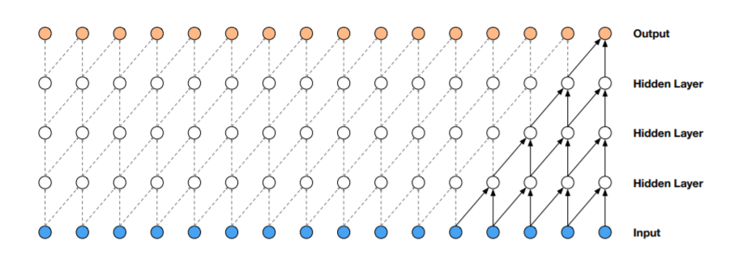

# WaveNet

## Background

WaveNet\([https://arxiv.org/abs/1609.03499](https://arxiv.org/abs/1609.03499)\) is a neural network architecture published by DeepMind at Sep 2016. The work is inspired by generative models such as  Pixel CNN\([https://arxiv.org/abs/1606.05328](https://arxiv.org/abs/1606.05328)\) and Pixel RNN\([https://arxiv.org/abs/1601.06759](https://arxiv.org/abs/1601.06759)\) on generating images and text.

The model is mainly tackling the task of text-to-speech \(TTS\), which takes text as input and generate human-like speech. The novelty of WaveNet is that it uses a parameterized way to generate raw speech signal in comparison to the by-the-time state-of-the-art [concatenative TTS](https://scholar.google.com/citations?view_op=view_citation&hl=en&user=Es-YRKMAAAAJ&citation_for_view=Es-YRKMAAAAJ:u5HHmVD_uO8C), where a very large database of short speech fragments are recorded from a single speaker and then recombined to form complete utterances.  

Such an network architecture can be also applied to music generation, which is main focus of this book. It can generate unconditional music and conditional music. Of particular interest are conditional music models, which can generate music given a set of tags specifying e.g. genre or instruments. 

## Concepts

### Dilated Causal Convolution

The main ingredient of WaveNet are causal convolutions. The word "causal" is used in the sense that the prediction $$p(x_{t+1} | x_1,...x_t)$$ emitted by the model at timestep $$t $$ cannot depend on any of the future time steps $$x_{t+1}, x_{t+2},...,x_{T}$$.

There is a concept in the context of neural network called receptive field, specific to each node, is the spatial connectivity that this node can reach. Take the below image as example, the top right of output node can reach 5 elements in the input. For modeling the high frequency raw audio\(44.1 kHz is 44.1k samples per second\) we may want a large receptive field to cover long enough history.

One of the problems of causal convolutions is that they require many layers, or large filters to increase the receptive field. To solve this problem WaveNet uses dilated convolution layers,  \) this is a convolution where the filter is applied over an area larger than its length by skipping input values with a certain step. It is equivalent to a convolution with a larger filter derived from the original filter by dilating it with zeros, but is significantly more efficient

