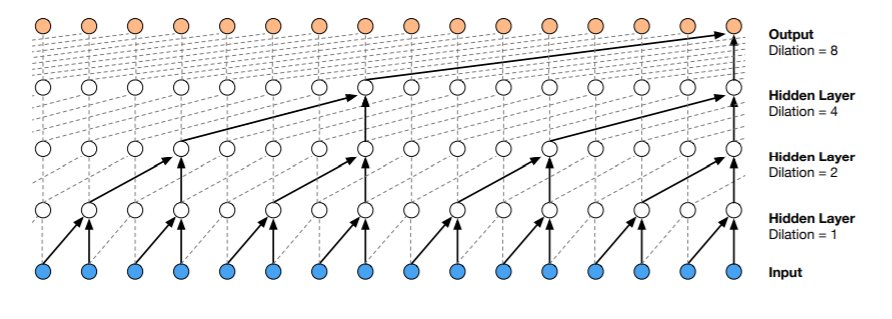
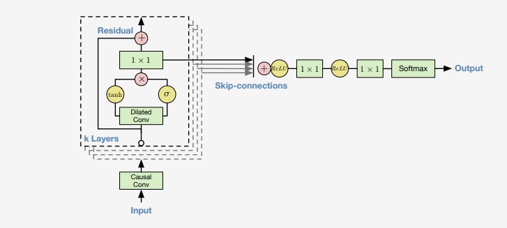

# WaveNet

## Background

WaveNet\([https://arxiv.org/abs/1609.03499](https://arxiv.org/abs/1609.03499)\) is a neural network architecture published by DeepMind at Sep 2016. The work is inspired by generative models such as  Pixel CNN\([https://arxiv.org/abs/1606.05328](https://arxiv.org/abs/1606.05328)\) and Pixel RNN\([https://arxiv.org/abs/1601.06759](https://arxiv.org/abs/1601.06759)\) on generating images and text.

The model is mainly tackling the task of text-to-speech \(TTS\), which takes text as input and generate human-like speech. The novelty of WaveNet is that it uses a parameterized way to generate raw speech signal in comparison to the by-the-time state-of-the-art [concatenative TTS](https://scholar.google.com/citations?view_op=view_citation&hl=en&user=Es-YRKMAAAAJ&citation_for_view=Es-YRKMAAAAJ:u5HHmVD_uO8C), where a very large database of short speech fragments are recorded from a single speaker and then recombined to form complete utterances.  

Such an network architecture can be also applied to music generation, which is main focus of this book. It can generate unconditional music and conditional music. Of particular interest are conditional music models, which can generate music given a set of tags specifying e.g. genre or instruments. 

## Concepts

### Dilated Causal Convolution

The main ingredient of WaveNet are causal convolutions\(See Figure 1\). The word "causal" is used in the sense that the prediction $$p(x_{t+1} | x_1,...x_t)$$ emitted by the model at timestep $$t $$ cannot depend on any of the future time steps $$x_{t+1}, x_{t+2},...,x_{T}$$.

Because models with causal convolutions do not have recurrent connections, they are typically faster to train than RNNs, especially when applied to very long sequences.

There is a concept in the context of neural network called receptive field, specific to each node, is the spatial connectivity that this node can reach. Take the below image as example, the top right of output node can reach 5 elements in the input. For modeling the high frequency raw audio\(44.1 kHz is 44.1k samples per second\) we may want a large receptive field to cover long enough history.


One of the problems of causal convolutions is that they require many layers, or large filters to increase the receptive field. To solve this problem WaveNet uses dilated convolution layers, this is a convolution where the filter is applied over an area larger than its length by skipping input values with a certain step. It is equivalent to a convolution with a larger filter derived from the original filter by dilating it with zeros, but is significantly more efficient.



In the paper it uses dilation of $$1,2,...,512,1,2...512,1,2...,512$$ layers. For example, each of 1,2,4,...,512 will have a receptive field of 1024 and can be an much more efficient than using $$1\times1024$$ convolution counterpart. Stacking these blocks will further enlarge the receptive field.

### Softmax Distributions and Companding Transformation

WaveNet uses softmax to model the conditional distributions $$p(x_{t+1} | x_1,...x_t)$$. The reason using a categorical distribution even for  continuous audio data is that a categorical distribution is more flexible and can more easily model arbitrary distributions because it makes no assumptions about their shape. 

Typically raw audio is stored in 16-bit integers for each time step which means our softmax layer will have 65,536 classes. To make this tractable, the author applied $$\mu$$ - law, which is a[ companding algorithm](https://en.wikipedia.org/wiki/%CE%9C-law_algorithm) to encode raw audio. This reduces the number of classes to predict down to 256. 

### Gated Activation Units

Normally people will add RELU as activation function to the output of a convolution layer.

$$z=RELU(W_{f,k}*x)$$ , where $$f$$ is denotes the filter, $$k$$ is layer index and $$ * $$ is convolution operator. 

In WaveNet, inspired by [PixelCNN](https://arxiv.org/pdf/1606.05328.pdf), the authors suggest using a Gated Activation instead of RELU as this yields significantly better result for modeling audio. This is denote by:

$$
z=tanh(W_{f,k}*x)\odot\sigma(W_{g,k}*x)
$$

Here $$g$$ denotes gate and $$\odot$$ is the element-wise multiplication operator.

### Residual Learning and Skip Connections

The idea of using Residual Learning comes from [ResNet.](https://arxiv.org/abs/1512.03385) Residual learning is tackling the degradation problem which states that with the network depth increasing, accuracy gets saturated and then degrades rapidly. Surprisingly this is not due to overfitting as the training error also decreases. To illustrate this, consider we have a shallow network and deep network, the training error of deep network should never fall below its shallow counterparts as we can always just make the added layer identity to yield same result as the shallow one. That is to say the standard back-propagation has hard time to learn the identity mapping. 

So in ResNet the model is like this: suppose the desired mapping that we want is $$H(x) $$. Instead of optimizing against $$H(x)$$ we let our stacked non-linear layers to optimize over $$F(x):=H(x)-x$$. In the ResNet paper it hypothesized that it is easier to learn this residual mapping in comparison to identity mapping. 

As described in the below figure, suppose there are k layers, each layer builds on top of the last one. For instance in Figure 2 we have 5 layers. For each layer, the input is the output of last layer, a dilated convolution is applied on the input to produce the z. Then it splits into two ways. For one way, a 1x1 convolution layer is applied on z and then a element-wise sum with input will produce the output of this layer, which is also the input of next layer. The other way is also to apply a different 1x1 convolution, but this time we add up all the output of this 1x1 convolution across different layers, then go through RELU-&gt;1x1 convolution-&gt;RELU-&gt;1x1 convolution-&gt;Softmax, which is shown in the right part of Figure 2 to form the final output of this example case. 



### Global and Local Conditioning

WaveNet can model additional input other than raw audio. The conditional distribution now becomes

 $$p(x|h) = \prod_{t=1}^{T}P(x_t|x_1,...x_{t-1},h)$$ 

There are two types of conditioning:

* Global Condition: $$h$$ remains constant for all $$x_1, ...,x_t$$\) e.g. a speaker embedding in a TTS model. The corresponding z now becomes $$z=tanh(W_{f,k}*x+V_{f,k}^{T}h)\odot\sigma(W_{g,k}*x+V_{g,k}^{T}h) $$. Note here it is matrix multiplication instead of convolution as $$h$$ is constant.
* Local Conditioning:  $$h$$ is not constant across all time steps, could be one value in $$x_1,...x_4$$ , then different value for $$x_5,...,x_8$$, which usually have a lower sampling frequency than the audio. In the paper the authors first use transposed convolution\(sometimes also called deconvolution\) to upsample $$h$$ to have same resolution as audio, assume this new time series is $$y$$. Now z becomes $$z=tanh(W_{f,k}*x+V_{f,k}^{T}*y)\odot\sigma(W_{g,k}*x+V_{g,k}^{T}*y) $$. Note here we have 1x1 convolution on the upsampled $$y$$.

## Code Review

Here I use a tensorflow implementation from ibab. The code can be found in his Github\([https://github.com/ibab/tensorflow-wavenet](https://github.com/ibab/tensorflow-wavenet)\). This implementation is relatively complete and well tested. In the follow-up section, I will highlight some key part of code. The model is trained on [VCTK corpus](http://homepages.inf.ed.ac.uk/jyamagis/page3/page58/page58.html), which is a speech dataset recording from 109 native English speakers. The global conditioning for this dataset is the category.

Compare to the original paper, the small differences and tricks are:

* Local Conditioning is not implemented
* Separate 1x1 convolution layer for the skip connection and output

There are also some tricks

* Silence crop on the audio file
* Multi-threading on I/O 
* Smart way to do dilated causal convolution.
* One-hot encoding on the sample input

### Input

```python
import librosa
# if sample rate is None, then by default it is 22khz
# audio can have size (1,n) or (2,n), 1 for mono and two for stereo,
# we have to make it 1-d
audio, _ = librosa.load(filename, sr=sample_rate, mono=True)
audio = audio.reshape(-1, 1)
```

For a wav file that has 44.1kHz sample rate, which is 44.1k samples per second, a 70-second file will have size $$44100*70$$ sample points. Librosa will read each point as a real value between 0 and 1. The first thing after we read the audio sample is to apply $$\mu$$ - law encoding which make this real value an integer between 0 and 256\(configurable\). The audio now has shape \(batch\_size, ?, 1\) where ? is the length of audio and 1 is the channel.

Next an optional one-hot encoding is applied to each 0-256 element so that input will reshaped to \(batch\_size, ?, 256\) for the network.

### Network

```python
def _create_network(self, input_batch):
    """
    :param input_batch: shape is (batch_size, -1, quantitative_channel), in our case is (1, -1, 256)
    :return:
    """
    outputs = []
    current_layer = input_batch

    # Pre-process the input with a regular convolution
    current_layer = self._create_causal_layer(current_layer)

    output_width = tf.shape(input_batch)[1] - self.receptive_field + 1

    # Add all defined dilation layers.
    with tf.name_scope('dilated_stack'):
        for layer_index, dilation in enumerate(self.dilations):
            with tf.name_scope('layer{}'.format(layer_index)):
                output, current_layer = self._create_dilation_layer(
                        current_layer, layer_index, dilation,
                        global_condition_batch, output_width)
                outputs.append(output)

    with tf.name_scope('postprocessing'):
        # Perform (+) -> ReLU -> 1x1 conv -> ReLU -> 1x1 conv to
        # postprocess the output.
        w1 = self.variables['postprocessing']['postprocess1']
        w2 = self.variables['postprocessing']['postprocess2']
        if self.use_biases:
            b1 = self.variables['postprocessing']['postprocess1_bias']
            b2 = self.variables['postprocessing']['postprocess2_bias']

        # We skip connections from the outputs of each layer, adding them
        # all up here.
        total = sum(outputs)
        transformed1 = tf.nn.relu(total)
        conv1 = tf.nn.conv1d(transformed1, w1, stride=1, padding="SAME")
        if self.use_biases:
            conv1 = tf.add(conv1, b1)
        transformed2 = tf.nn.relu(conv1)
        conv2 = tf.nn.conv1d(transformed2, w2, stride=1, padding="SAME")
        if self.use_biases:
            conv2 = tf.add(conv2, b2)

    return conv2
```

Let's ignore the global conditioning and focus on the core part of WaveNet.

This implementation follows the network defined in Figure 3. Let's start with line 14, we see the output is append to the outputs and current layer is reassigned with returned value from  self.\_create\_dilation\_layer. The output here, which refers to the skip connection in Figure 3, will be added up at line 34 and go through RELU-&gt;1x1 conv-&gt;RELU-&gt;1x1 conv.

Let's further see how self.\_create\_dilation\_layer works. This is the left part of Figure 3.

```python
def _create_dilation_layer(self, input_batch, layer_index, dilation,
                           global_condition_batch, output_width):
    '''
    Creates a single causal dilated convolution layer.
    Args:
         input_batch: Input to the dilation layer.
         layer_index: Integer indicating which layer this is.
         dilation: Integer specifying the dilation size.
         global_conditioning_batch: Tensor containing the global data upon
             which the output is to be conditioned upon. Shape:
             [batch size, 1, channels]. The 1 is for the axis
             corresponding to time so that the result is broadcast to
             all time steps.
    The layer contains a gated filter that connects to dense output
    and to a skip connection:
           |-> [gate]   -|        |-> 1x1 conv -> skip output
           |             |-> (*) -|
    input -|-> [filter] -|        |-> 1x1 conv -|
           |                                    |-> (+) -> dense output
           |------------------------------------|
    Where `[gate]` and `[filter]` are causal convolutions with a
    non-linear activation at the output. Biases and global conditioning
    are omitted due to the limits of ASCII art.
    '''

    # for each layer index, this one has 4 variables, e.g
    # filter has shape [self.filter_width, self.residual_channels, self.dilation_channels]
    # gate has shape [self.filter_width, self.residual_channels, self.dilation_channels]
    # dense has shape  [1, self.dilation_channels, self.residual_channels]
    # skip has shape [1,self.dilation_channels,self.skip_channels]
    variables = self.variables['dilated_stack'][layer_index]

    weights_filter = variables['filter']
    weights_gate = variables['gate']

    conv_filter = causal_conv(input_batch, weights_filter, dilation)
    conv_gate = causal_conv(input_batch, weights_gate, dilation)

    if global_condition_batch is not None:
        weights_gc_filter = variables['gc_filtweights']
        conv_filter = conv_filter + tf.nn.conv1d(global_condition_batch,
                                                 weights_gc_filter,
                                                 stride=1,
                                                 padding="SAME",
                                                 name="gc_filter")
        weights_gc_gate = variables['gc_gateweights']
        conv_gate = conv_gate + tf.nn.conv1d(global_condition_batch,
                                             weights_gc_gate,
                                             stride=1,
                                             padding="SAME",
                                             name="gc_gate")

    if self.use_biases:
        filter_bias = variables['filter_bias']
        gate_bias = variables['gate_bias']
        conv_filter = tf.add(conv_filter, filter_bias)
        conv_gate = tf.add(conv_gate, gate_bias)

    # out is gated activation unit
    out = tf.tanh(conv_filter) * tf.sigmoid(conv_gate)

    # The 1x1 conv to produce the residual output
    weights_dense = variables['dense']
    transformed = tf.nn.conv1d(
            out, weights_dense, stride=1, padding="SAME", name="dense")

    # The 1x1 conv to produce the skip output
    skip_cut = tf.shape(out)[1] - output_width
    out_skip = tf.slice(out, [0, skip_cut, 0], [-1, -1, -1])
    weights_skip = variables['skip']
    skip_contribution = tf.nn.conv1d(
            out_skip, weights_skip, stride=1, padding="SAME", name="skip")

    if self.use_biases:
        dense_bias = variables['dense_bias']
        skip_bias = variables['skip_bias']
        transformed = transformed + dense_bias
        skip_contribution = skip_contribution + skip_bias

    input_cut = tf.shape(input_batch)[1] - tf.shape(transformed)[1]
    input_batch = tf.slice(input_batch, [0, input_cut, 0], [-1, -1, -1])

    return skip_contribution, input_batch + transformed

```

Note that this function has two outputs, one is the skip\_output, that will be added across different layers at the end, the other is dense output\(with input\_batch added as residual\), which is the input of next layer. Because of the dense and skip 1x1 conv filter are set to have out\_channel fixed, they can add up and keep as all layers produces same dimension output.

The magic part of this function is causal\_conv. To understand what it does, let's look into the code

```python
def time_to_batch(value, dilation, name=None):
    """
    :param value: 3-d tensor of shape [batch, in_width, in_channels]
    :param dilation: int
    :param name:
    :return:
    """
    with tf.name_scope('time_to_batch'):
        shape = tf.shape(value)
        pad_elements = dilation - 1 - (shape[1] + dilation - 1) % dilation
        padded = tf.pad(value, [[0, 0], [0, pad_elements], [0, 0]])
        reshaped = tf.reshape(padded, [-1, dilation, shape[2]])
        transposed = tf.transpose(reshaped, perm=[1, 0, 2])
        return tf.reshape(transposed, [shape[0] * dilation, -1, shape[2]])


def batch_to_time(value, dilation, name=None):
    with tf.name_scope('batch_to_time'):
        shape = tf.shape(value)
        prepared = tf.reshape(value, [dilation, -1, shape[2]])
        transposed = tf.transpose(prepared, perm=[1, 0, 2])
        return tf.reshape(transposed,
                          [tf.div(shape[0], dilation), -1, shape[2]])


def causal_conv(value, filter_, dilation, name='causal_conv'):
    with tf.name_scope(name):
        filter_width = tf.shape(filter_)[0]
        if dilation > 1:
            transformed = time_to_batch(value, dilation)
            # This indeed call conv2d with reshaped value and filter,
            # where value is reshaped to [batch, 1, in_width, in_channels],
            # filter is reshaped to [1, filter_width, in_channels, out_channels
            conv = tf.nn.conv1d(transformed, filter_, stride=1,
                                padding='VALID')
            restored = batch_to_time(conv, dilation)
        else:
            restored = tf.nn.conv1d(value, filter_, stride=1, padding='VALID')
        # Remove excess elements at the end.
        out_width = tf.shape(value)[1] - (filter_width - 1) * dilation
        result = tf.slice(restored,
                          [0, 0, 0],
                          [-1, out_width, -1])
        return result
```

We can see causal\_conv is composed from 3 parts, namely the time\_to\_batch, tf.nn.conv1d and batch\_to\_tome. Let me explain them one by one.

#### time\_to\_batch

```python
"""
Let me illustrate with an example. since value has shape = [batch, in_width, in_channels], 
assume batch = 1 and in_channel = 1. 

value =
np.array([[[1],
    [2],
    [3],
    [4],
    [5],
    [6],
    [7],
    [8]]]), the shape is (1,8,1)
if dilation = 2, then result is
[[[1.]
  [3.]
  [5.]
  [7.]]

 [[2.]
  [4.]
  [6.]
  [8.]]], the shape is (2,4,1)

if dilation = 4, then result is
[[[1.]
  [5.]]

 [[2.]
  [6.]]

 [[3.]
  [7.]]

 [[4.]
  [8.]]], the shape is (4,2,1)

i.e when filter apply to [1,5], it will skip [2,3,4]
"""
```

#### batch\_to\_time

Inverse of time\_to\_batch

#### causal\_conv

The function first calls time\_to\_batch to create input for convolution, then call tf.nn.conv1d to do convolution operation and finally call batch\_to\_time to bring the 1st dimension back to batch\_size.

About conv1d:

```python
"""
# This indeed call conv2d with reshaped value and filter,
# where value is reshaped to [batch, 1, in_width, in_channels],
# filter is reshaped to [1, filter_width, in_channels, out_channels
conv = tf.nn.conv1d(transformed, filter_, stride=1,
                    padding='VALID')
"""
```


